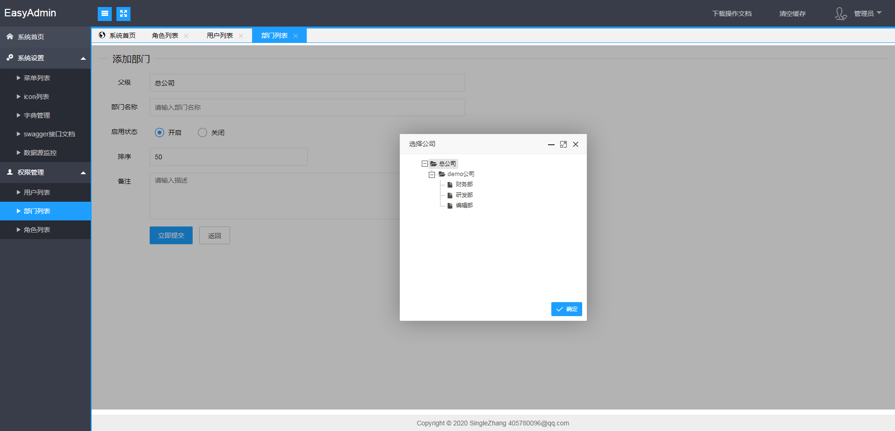

# easyadmin

#### 介绍
做了很多系统,其实后台的功能大同小异,为了快速搭建项目框架进入开发,所以打算做一个EasyAdmin作为后台的脚手架,节省时间。
由于现在很多追捧微服务、前后端分离，不过个人觉得后台系统的话，能符合管理人员操作就OK,越简单越方便越好
一般情况下，后台管理系统还是以单体系统居多，模块多了也可以将系统拆分，至于微服务的话，个人认为学习和了解是可以的,真正部署到生产环境的话,还是觉得需要按实际业务情况来定,不要动不动就上微服务，系统的架构是分阶段性慢慢演进的，不过因为本人真的没接触过成百上千个服务器的系统所以不好过多评论^_^
后期在新版本中增加微服务版、前后端分离版。

#### 功能规划清单

1.  后台用户管理
2.  部门管理
3.  菜单管理
4.  角色管理
5.  字典管理
6.  权限分配
7.  配置管理
8.  登录日志
9.  操作日志
10. 登录日志
11. 定时任务

### 功能预览

